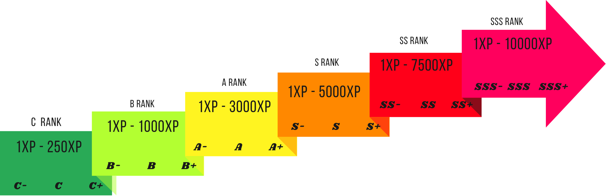

# ⚔️ QuarrelsomeQuests

 

QuarrelsomeQuests is a deck-building card game revolving around your ‘heroes’, cards that go into battle for you. You can collect, purchase, and pull these cards at the in-game store, or collect them from various in-game events! Each card has a set of moves attached to it, which allows for each card, when in battle, have a unique playstyle, causing a fun gameplay loop.

## 💻 How to Install
Because QuarrelsomeQuests is under development, there is no download package to play the game as a desktop application. But the game IS playable on GitHub Pages. There you can start your hunt for a perfect deck!

Play on the GitHub Pages site here:
👉 https://volive-io.github.io/QuarrelsomeQuests/

## 📋 Details
* This project is written in the classic ‘WebDev’ language kit, utilizing HTML5, CSS, and JavaScript. This allows it to run fully in the browser and is compatible with console commands.
* QuarrelsomeQuests started in **Jul 5, 2024**, as a fighter game, but since has slowly evolved into the deck building game it is now.
* This project is still under development, and large updates are planned, stay tuned!
* QuarrelsomeQuests uses a Threshold ranking system. This format of ranking players that differs from the usual ranking of sorting players by points; instead by making 'thresholds' for each category, when the maximum value for that cadigory is reached, the player gets permoted a rank and there new points are set to 0, allowing them to work up to the nex threshold (ex: C = 1-50, B 1-100, A = 1-250, etc), example shown below. </img> 
* Of all the features in QuarrelsomeQuests, the most diffcult to set up was the Dinamic Threshhold Rankbar Display. This utilizes JavaScript functions to display a rankbar showing progress using the threshold ranking system.

## 💪 Contributors!
These people made this project possible.
<ul>
  <li><a href="https://github.com/vOlive-io">vOlive-io</a></li>
  <li><a href="https://github.com/vOlive2">vOlive2</a></li>
</ul>
